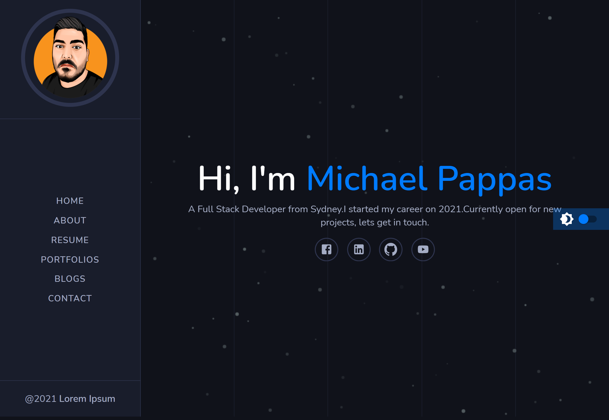

# Project Title

  <h1 align="center">React Portfolio 👋</h1>

  <p align="center">
    
    
    
    
</p>

<p align="center">
    
    
    
    
    
    
</p>

# Description

  

  My personal portfolio.

[portfolio link](https://michaelpappas2662.github.io/Portfolio-2.0/)



# Table of Contents

* [Installation](#-Installation)
* [Usage](#-Usage)
* [License](#-Installation)
* [Contributing](#-Contributing)
* [Tests](#-Tests)
* [Questions](#-Contact-Information)

## User Story

```md
AS AN employer looking for candidates with experience building single-page applications
I WANT to view a potential employee's deployed React portfolio of work samples
SO THAT I can assess whether they're a good candidate for an open position
```

## Acceptance Criteria

```md
GIVEN a single-page application portfolio for a web developer
WHEN I load the portfolio
THEN I am presented with a page containing a header, a section for content, and a footer
WHEN I view the header
THEN I am presented with the developer's name and navigation with titles corresponding to different sections of the portfolio
WHEN I view the navigation titles
THEN I am presented with the titles About Me, Portfolio, Contact, and Resume, and the title corresponding to the current section is highlighted
WHEN I click on a navigation title
THEN I am presented with the corresponding section below the navigation without the page reloading and that title is highlighted
WHEN I load the portfolio the first time
THEN the About Me title and section are selected by default
WHEN I am presented with the About Me section
THEN I see a recent photo or avatar of the developer and a short bio about them
WHEN I am presented with the Portfolio section
THEN I see titled images of six of the developer’s applications with links to both the deployed applications and the corresponding GitHub repositories
WHEN I am presented with the Contact section
THEN I see a contact form with fields for a name, an email address, and a message
WHEN I move my cursor out of one of the form fields without entering text
THEN I receive a notification that this field is required
WHEN I enter text into the email address field
THEN I receive a notification if I have entered an invalid email address
WHEN I am presented with the Resume section
THEN I see a link to a downloadable resume and a list of the developer’s proficiencies
WHEN I view the footer
THEN I am presented with text or icon links to the developer’s GitHub and LinkedIn profiles, and their profile on a third platform (Stack Overflow, Twitter)
```

# Installation

  `git clone`

  `git install` (all the dependencies)

  `npm start`

# Usage

  Demonstrate my personal repositories

## License

  Licensed under MIT.<br/>
  For more information, visit this link.<br/>
  <https://opensource.org/licenses/MIT>
  
# Contributing

  not necessary

# Tests

  not necessary

# Contact Information

* GitHub Username: MichaelPappas2662
* Contact Email: email@email.com
  